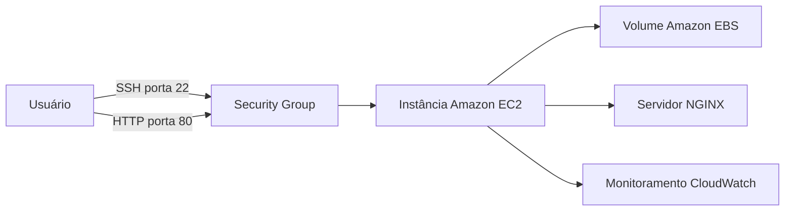
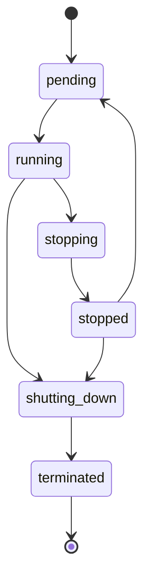

# Gerenciamento de Instâncias EC2 na AWS


Projeto desenvolvido para o desafio da **DIO** sobre gerenciamento de instâncias **Amazon EC2**.

O objetivo deste repositório é documentar os principais conceitos, etapas práticas, comandos e aprendizados relacionados à criação, configuração, acesso, monitoramento e gerenciamento do ciclo de vida de instâncias EC2 na AWS.

> Antes da entrega, substitua os campos de autor e adicione suas próprias capturas de tela na pasta `images`.

---

## Sumário

- [Objetivos](#objetivos)
- [O que é o Amazon EC2](#o-que-é-o-amazon-ec2)
- [Arquitetura do laboratório](#arquitetura-do-laboratório)
- [Etapas do laboratório](#etapas-do-laboratório)
- [Ciclo de vida da instância](#ciclo-de-vida-da-instância)
- [Segurança](#segurança)
- [Custos e limpeza](#custos-e-limpeza)
- [Comandos úteis](#comandos-úteis)
- [Principais aprendizados](#principais-aprendizados)
- [Evidências](#evidências)
- [Estrutura do projeto](#estrutura-do-projeto)
- [Como publicar no GitHub](#como-publicar-no-github)
- [Referências](#referências)

---

## Objetivos

Ao realizar este laboratório, foi possível:

- compreender os conceitos básicos do Amazon EC2;
- criar e configurar uma instância virtual;
- selecionar uma imagem de máquina, também chamada de AMI;
- escolher o tipo de instância;
- configurar rede, armazenamento e grupo de segurança;
- criar ou utilizar um par de chaves;
- conectar-se a uma instância Linux;
- instalar e executar um servidor web;
- iniciar, interromper, reiniciar e encerrar uma instância;
- compreender cuidados com segurança e custos;
- documentar o processo utilizando Markdown e GitHub.

---

## O que é o Amazon EC2

O **Amazon Elastic Compute Cloud**, conhecido como Amazon EC2, é um serviço da AWS utilizado para criar e executar servidores virtuais na nuvem.

Esses servidores virtuais são chamados de **instâncias**.

Na criação de uma instância, algumas configurações importantes são:

| Configuração | Descrição |
|---|---|
| Região | Localização geográfica onde o recurso será criado |
| AMI | Imagem contendo o sistema operacional |
| Tipo de instância | Define CPU, memória e capacidade de rede |
| Par de chaves | Utilizado para autenticação e acesso |
| Security Group | Regras de entrada e saída da instância |
| VPC | Rede virtual utilizada pela instância |
| Sub-rede | Segmento da VPC onde a instância será criada |
| EBS | Armazenamento persistente da instância |
| Tags | Identificação e organização dos recursos |

---

## Arquitetura do laboratório



O laboratório utiliza uma arquitetura simples:

1. uma instância Linux;
2. um volume EBS como disco;
3. um grupo de segurança;
4. acesso administrativo por SSH;
5. servidor web NGINX;
6. monitoramento básico pelo console da AWS.

---

## Etapas do laboratório

### 1. Acesso ao Console AWS

O primeiro passo foi acessar o Console de Gerenciamento da AWS e abrir o serviço Amazon EC2.

Também foi necessário verificar a região selecionada.

A região é importante porque os recursos criados em uma região não aparecem automaticamente em outra.

### 2. Criação da instância

No painel do EC2, foi selecionada a opção **Executar instância**.

Configuração sugerida:

| Campo | Valor |
|---|---|
| Nome | `dio-ec2-lab` |
| Sistema operacional | Amazon Linux 2023 |
| Tipo | Tipo disponível para laboratório ou nível gratuito |
| Armazenamento | Volume EBS padrão |
| Tag Project | `dio-aws` |
| Tag Environment | `lab` |

### 3. Configuração do par de chaves

Foi criado ou selecionado um par de chaves para permitir o acesso à instância.

Cuidados importantes:

- não publicar o arquivo `.pem`;
- guardar a chave em local seguro;
- não enviar a chave para outras pessoas;
- remover ou substituir uma chave comprometida.

No Linux ou macOS, pode ser necessário ajustar a permissão:

```bash
chmod 400 minha-chave.pem
```

### 4. Configuração do Security Group

O grupo de segurança controla o tráfego permitido.

Exemplo de configuração:

| Tipo | Porta | Origem |
|---|---:|---|
| SSH | 22 | Meu endereço IP |
| HTTP | 80 | `0.0.0.0/0` |
| HTTPS | 443 | `0.0.0.0/0` |

> A porta SSH não deve permanecer aberta para toda a internet. O ideal é limitar o acesso ao endereço IP autorizado.

### 5. Inicialização da instância

Após revisar as configurações, a instância foi iniciada.

Estados observados durante a inicialização:

```text
pending → running
```

Também foi necessário aguardar as verificações de status da AWS.

### 6. Conexão com a instância

Exemplo de conexão com Amazon Linux:

```bash
ssh -i "minha-chave.pem" ec2-user@IP_PUBLICO
```

Exemplo com Ubuntu:

```bash
ssh -i "minha-chave.pem" ubuntu@IP_PUBLICO
```

### 7. Validação do ambiente

Comandos utilizados para verificar a instância:

```bash
whoami
hostname
uname -a
cat /etc/os-release
df -h
free -h
ip addr
```

### 8. Instalação do NGINX

No Amazon Linux 2023:

```bash
sudo dnf update -y
sudo dnf install -y nginx
sudo systemctl enable nginx
sudo systemctl start nginx
```

Página de teste:

```bash
echo '<h1>Laboratório EC2 - DIO</h1>' | sudo tee /usr/share/nginx/html/index.html
```

Teste local:

```bash
curl http://localhost
```

Depois, o servidor pode ser acessado pelo navegador:

```text
http://IP_PUBLICO_DA_INSTANCIA
```

### 9. Monitoramento

No console do EC2, foram observadas métricas como:

- utilização de CPU;
- entrada e saída de rede;
- verificações de status;
- estado da instância.

### 10. Gerenciamento do ciclo de vida

Foram estudadas as ações:

- iniciar;
- interromper;
- reinicializar;
- encerrar.

---

## Ciclo de vida da instância



| Estado | Significado |
|---|---|
| pending | A instância está sendo preparada |
| running | A instância está ligada |
| stopping | A instância está sendo interrompida |
| stopped | A instância está desligada |
| shutting-down | A instância está sendo encerrada |
| terminated | A instância foi encerrada |

### Interromper não é o mesmo que encerrar

Ao interromper uma instância:

- a máquina virtual deixa de executar;
- ela pode ser iniciada novamente;
- o volume EBS normalmente permanece;
- o endereço IPv4 público automático pode mudar;
- alguns recursos podem continuar gerando custos.

Ao encerrar uma instância:

- ela não poderá ser iniciada novamente;
- o volume raiz pode ser removido, dependendo da configuração;
- outros recursos ainda precisam ser revisados.

---

## Segurança

Boas práticas importantes:

- não utilizar a conta root para tarefas diárias;
- habilitar autenticação multifator;
- utilizar o princípio do menor privilégio;
- não salvar credenciais no código;
- não publicar arquivos `.pem`;
- limitar o acesso SSH;
- manter o sistema operacional atualizado;
- revisar regras antigas dos grupos de segurança;
- utilizar funções IAM quando a instância precisar acessar outros serviços AWS.

Atualização do Amazon Linux:

```bash
sudo dnf update -y
```

Atualização do Ubuntu:

```bash
sudo apt update
sudo apt upgrade -y
```

---

## Custos e limpeza

Mesmo que uma instância seja interrompida, outros recursos podem continuar gerando custos.

Exemplos:

- volumes EBS;
- snapshots;
- endereços IPv4;
- Elastic IP;
- transferência de dados;
- balanceadores de carga;
- outros serviços associados.

Checklist de limpeza:

- [ ] encerrar instâncias desnecessárias;
- [ ] verificar volumes EBS;
- [ ] remover snapshots desnecessários;
- [ ] verificar endereços IP;
- [ ] revisar grupos de segurança;
- [ ] revisar pares de chaves;
- [ ] verificar o painel de cobrança;
- [ ] remover recursos temporários.

---

## Comandos úteis

Listar instâncias:

```bash
aws ec2 describe-instances   --query "Reservations[].Instances[].{ID:InstanceId,Tipo:InstanceType,Estado:State.Name,IP:PublicIpAddress}"   --output table
```

Iniciar uma instância:

```bash
aws ec2 start-instances --instance-ids i-xxxxxxxxxxxxxxxxx
```

Interromper uma instância:

```bash
aws ec2 stop-instances --instance-ids i-xxxxxxxxxxxxxxxxx
```

Reiniciar uma instância:

```bash
aws ec2 reboot-instances --instance-ids i-xxxxxxxxxxxxxxxxx
```

Encerrar uma instância:

```bash
aws ec2 terminate-instances --instance-ids i-xxxxxxxxxxxxxxxxx
```

Outros comandos estão disponíveis no arquivo:

```text
docs/comandos-aws-cli.md
```

---

## Principais aprendizados

Durante o laboratório, foi possível compreender que:

1. O EC2 não funciona isoladamente, pois depende de rede, armazenamento, segurança e permissões.
2. O Security Group deve permitir somente o tráfego necessário.
3. Interromper uma instância não remove automaticamente todos os recursos.
4. Volumes EBS possuem ciclo de vida próprio.
5. O IPv4 público automático pode mudar após um processo de stop e start.
6. Tags ajudam a organizar recursos e controlar custos.
7. Scripts de user data permitem automatizar configurações.
8. A limpeza dos recursos é uma etapa importante do laboratório.
9. A documentação facilita a reprodução e manutenção do ambiente.

---

## Evidências

As capturas de tela devem ser armazenadas na pasta `images`.

Sugestões:

```text
images/01-instancia-criada.png
images/02-detalhes-instancia.png
images/03-security-group.png
images/04-conexao-ssh.png
images/05-nginx-funcionando.png
images/06-instancia-encerrada.png
```

Exemplo para mostrar uma imagem no README:

```markdown

```

Antes de publicar, oculte informações sensíveis.

---

## Estrutura do projeto

```text
dio-lab-gerenciamento-instancias-ec2/
├── README.md
├── CHECKLIST.md
├── ENTREGA-DIO.md
├── .gitignore
├── docs/
│   ├── aprendizados.md
│   ├── comandos-aws-cli.md
│   └── guia-pratico.md
├── images/
│   └── README.md
└── scripts/
    └── user-data-amazon-linux.sh
```

---

## Como publicar no GitHub

Nome recomendado para o repositório:

```text
dio-lab-gerenciamento-instancias-ec2
```

Comandos:

```bash
git init
git add .
git commit -m "docs: adiciona laboratório de gerenciamento de instâncias EC2"
git branch -M main
git remote add origin https://github.com/SEU-USUARIO/dio-lab-gerenciamento-instancias-ec2.git
git push -u origin main
```

Substitua `SEU-USUARIO` pelo seu usuário do GitHub.

---

## Referências

- Amazon EC2: https://docs.aws.amazon.com/pt_br/ec2/
- Instâncias EC2: https://docs.aws.amazon.com/pt_br/AWSEC2/latest/UserGuide/Instances.html
- Ciclo de vida: https://docs.aws.amazon.com/pt_br/AWSEC2/latest/UserGuide/ec2-instance-lifecycle.html
- Security Groups: https://docs.aws.amazon.com/pt_br/AWSEC2/latest/UserGuide/ec2-security-groups.html
- AWS CLI: https://docs.aws.amazon.com/pt_br/cli/
- GitHub Markdown: https://docs.github.com/pt/get-started/writing-on-github

---

## Autor

Desenvolvido por **SEU NOME** durante a formação da DIO.

GitHub:

```text
https://github.com/SEU-USUARIO
```

LinkedIn:

```text
https://www.linkedin.com/in/SEU-PERFIL/
```
